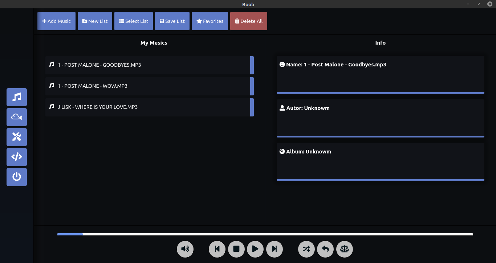

# Boob music player

## Supported Platforms

- [x] Linux
- [ ] Windows
- [ ] Mac OS

## Using the source

### You need install

- Nodejs    V12.18.3 or Higher
- Npm       V6.14.6 or Higher
- Chromium or Chrome

### Download && Execute
- Linux or Windows
> git clone https://github.com/Mastercliff/electron-music-player

> cd electron-music-player

> npm install

> npm start

## Compiled version

- Linux
> Download - none

- Windows
> Download - none
- MacOS
> Download - none

## Version info

In trello you can see all changes and future updates

> https://trello.com/b/kgB9LDAI/boob-music-player
